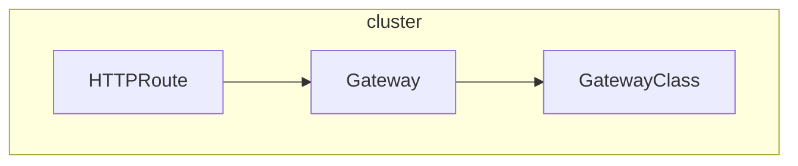
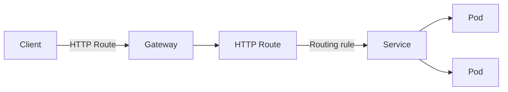
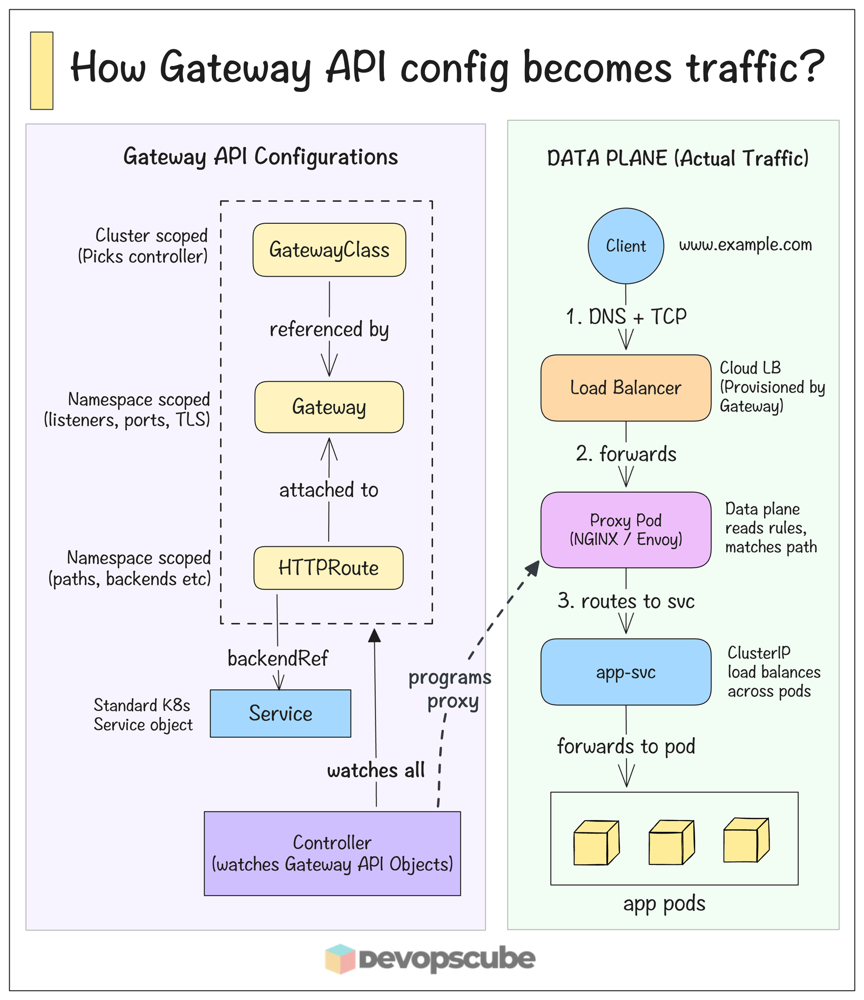

# Gateway API
> Gateway API is a family of API kinds that provide dynamic infrastructure provisioning and advanced traffic routing.

**Make network services available by using an extensible, role-oriented, protocol-aware configuration mechanism. Gateway API is an add-on containing API kinds that provide dynamic infrastructure provisioning and advanced traffic routing**

## Design Principles
- **Role-oriented**: gateway API kinds are modelled after organizational roles that are responsible for managing kubernetes service networking:
  - **Infrastructure Provider**: Manages Infrastructure that allows multiple isolated cluster to serve multiple tenants, e.g. a cloud provider.
  - **Cluster Operator**: Manages cluster and is typically concerned with policies, network access, application permissions, etc.
  - **Application Developers**: Manages an application running in a cluster and is typically concerned with application-level configuration and Service composition.
- **Portable**: Gateway API specifications are defined as custom resources and are supported by many implementations
- **Expressive**: Gateway API kinds support functionality for common traffic routing use cases such as header-based matching, traffic weighting, and others that were only possible in Ingress by using custom annotations.
- **Extensible**: Gateway allows for custom resources to be linked at various layers of the API. This makes granular customization possible at the appropriate places within the API structure.

## Resource Model
Gateway API has four stable API kinds:
- **GatewayClass**: Defines a set of gateways within common configuration and managed by a controller that implements the class.
- **Gateway**: Defines an instance of traffic handling infrastructure, such as cloud load balancer.
- **HTTPRoute**: Defines HTTP-specific rules for mapping traffic a Gateway listener to a representation of backend network endpoints. These endpoints are often represented as a Service.
- **GRPCRoute**: Defines gRPC-specific rules for mapping traffic from a Gateway listener to a representation of backend network endpoints. These endpoints are often represented as a Service.

Gateway API is organized into different kinds that have interdependent relationships to support the role-oriented nature of organizations.

A Gateway object is associated with exactly one GatewayClass; the GatewayClass describes the gateway controller responsible for managing Gateways of this class.

One or more route kinds such as HTTPRoute, are then associated to Gateways. A Gateway can filter the routes that may be attached to its `listeners`, forming a bidirectional trust model with routes.

The following figure illustrates the relationships of the three stable Gateway API kinds



### GatewayClass
Gateways can be implemented by different controllers, often with different configurations. A Gateway must be reference a GatewayClass that contains the name of the controller that implements the class.

A minimal GatewayClass example:

```yaml
apiVersion: gateway.networking.k8s.io/v1
kind: GatewayClass
metadata: 
  name: example-class
spec:
  controllerName: example.com/gateway-controller
```

### Gateway
A Gateway describes an instance of traffic handling infrastructure. It defines a network endpoint that can be used for processing traffic. i.e. filtering, balancing, splitting, etc. for backends such as a Service.

For example, a Gateway may represent a cloud load balancer or an in-cluster proxy server that is configured to accept HTTP traffic.

A typical Gateway resource example

```yaml
apiVersion: gateway.networking.k8s.io/v1
kind: Gateway
metadata:
  name: example-gateway
  namespace: example-namespace
spec:
  gatewayClassName: example-class
  listeners:
    - name: http
      protocol: HTTP
      port: 80
      hostname: "www.example.com"
      allowedRoutes:
        namespaces:
          from: Same
```
In this example:
- an instance of traffic handling infrastructure is programmed to listen for HTTP traffic on port 80.
- Since the `addresses` filed is unspecified, an address or hostname is assigned to the gateway by the implementation's controller. 
- This address is used as a network endpoint for processing traffic of backend network endpoints defined in routes.

### HTTPRoute
The HTTPRoute kind specifies routing behavior of HTTP requests from a Gateway listener to backend network endpoints.

For a Service backend, an implementation may represent the backend network endpoint as a Service IP or the backing EndPointSlices of the Service.

An HTTPRoute represents configuration that is applied to the underlying Gateway implementation. For example, defining a new HTTPRoute may result in configuring additional traffic rules in a cloud load balancer or in-cluster proxy server.

```yaml
apiVersion: gateway.networking.k8s.io/v1
kind: HTTPRoute
metadata: 
  name: example-httproute
spec:
  parentRefs:
    - name: example-gateway
  hostnames:
    - "www.example.com"
  rules:
    - matches:
        - path:
            type: PathPrefix
            value: /login
      backendRefs:
        - name: example-svc
          port: 8080
```

In this example:
- HTTP traffic from Gateway `example-gateway` with the Host: header set to `www.example.com` and the request path specified as `/login` will be routed to Service `example-svc` on port `8080`.

### GRPCRoute
- The GRPCRoute kind specifies routing behavior of gRPC requests from a Gateway listener to backend network endpoints.
- For a Service backend, an implementation may represent the backend network endpoint as a Service IP or the backing EndpointSlices of the Service.
- A GRPCRoute represents configuration that is applied to the underlying Gateway implementation. For example, defining a new GRPCRoute may result in configuring additional traffic routes in a cloud load balancer or in-cluster proxy server. 
- A typical GRPCRoute example:

```yaml
apiVersion: gateway.networking.k8s.io/v1
kind: GRPCRoute
metadata:
  name: example-grpcroute
spec:
  parentRefs:
    - name: example-gateway
    hostnames:
      - "svc.example.com"
    rules:
      - backendRefs:
          - name: example-svc
            port: 5001
```

- In this example, gRPC traffic from Gateway `example-gateway` with the host set to `svc.example.com` will be redirected to the service `example-svc` on the port `5001` from the same namespace

## Request Flow
- Here is a simple example of HTTP traffic being route to a service by using a Gateway and an HTTPRoute



In this example, the request flow for a Gateway implemented as a reverse proxy is:
1. THe client starts to prepare an HTTP request for the URL `http://www/example.com`
2. The client's DNS resolver queries for the destination name and learns a mapping to one or more IP addresses associated with the Gateway.
3. The client sends a request to the Gateway IP address, the reverse proxy receives the HTTP request and uses the Host: header to match a configuration that was derived from the Gateway and attached HTTPRoute.
4. Optionally, the reverse proxy can modify the request; for example, to add or remove headers, based on filter rules of the HTTPRoute.
5. Lastly, the reverse proxy forwards the request to one or more backends.

---

## Gateway API Controller
- In Ingress controllers, we define routing rules in the **Ingress Object**. The **Ingress Controller** handles the actual routing. The same concept applies to the Gateway API.
- While the Gateway API provides many objects to manage cluster traffic, the actual routing is done by a **Gateway API Controller*. This controller is not built into Kubernetes. You need to set up a third-party (vendor) controller, just like with ingress.
- Various Gateway API controllers are available. The following are some of the popular ones.
  - Nginx Gateway Fabric
  - Kong Gateway
  - Envoy Gateway
  - Traefik Gateway

### NGINX Gateway Fabric Architecture
The Nginx Gateway Fabric has the following two components
1. Control Plane
2. Data Plane

The following image illustrates the architecture of the Nginx Gateway Fabric controller.


#### Control Plane (handles config)
- The control plane runs a pod called the fabric controller. It's a **Kubernetes Controller** that watches Gateway API Resource. When you define routing rules, the controller reads them and converts them into NGINX config files.
- But the controller **doesn't handle real traffic**. It doesn't run NGINX itself.

#### Data Plane (Proxy Layer)
- The data plane handles the actual traffic. It's a separate NGINX proxy pod that **gets created automatically when you create a Gateway** resource. This pod runs NGINX along with an NGINX agent.
  - Here NGINX is the core proxy engine that handles actual network traffic. Routes requests to backend services based on configuration. Processes all incoming/outgoing traffic.
  - NGINX Agent is a helper process that dynamically manages NGINX configuration, watches kubernetes resources (like Gateway, Routes) translate them into valid NGINX config, applies the changes and safe reload of NGINX. 
- A kubernetes Service is also created for the NGINX pod. This service is exposed to the outside world using a LoadBalancer or NodePort, so client requests can reach your app.
- Whenever routing rules change, **the fabric controller sends** the updated NGINX config to the agent using gRPC. The agent then applies the new config to the NGINX Pod to route the traffic correctly.


### Gateway API Traffic flow
The following image shows how the traffic is routed to the cluster pods from outside world through the Kubernetes Gateway API Resource.



1. When we install the Gateway API Controller, it only deploys the Control Plane Controller.
2. When we create a **Gateway Custom Resource** configuration for our application, the Control Plane controller (Nginx Fabric) creates a Data Plane (proxy Pod - Nginx Agent) and a Load Balancer for it.
3. All the configurations from the Gateway and HTTPRoute custom resources are converted into routing rules inside proxy pod.
4. When someone tried to access the application, the request goes through the external Load Balancer, then reaches the Gateway API Data Plane (Proxy Pod).
5. The proxy pod will then send the traffic to the correct backend services based on rules.