# What is kubernetes Architecture?

- The following kubernetes architecture diagram shows all the components of the Kubernetes cluster and how external systems connect to the kubernetes cluster.

  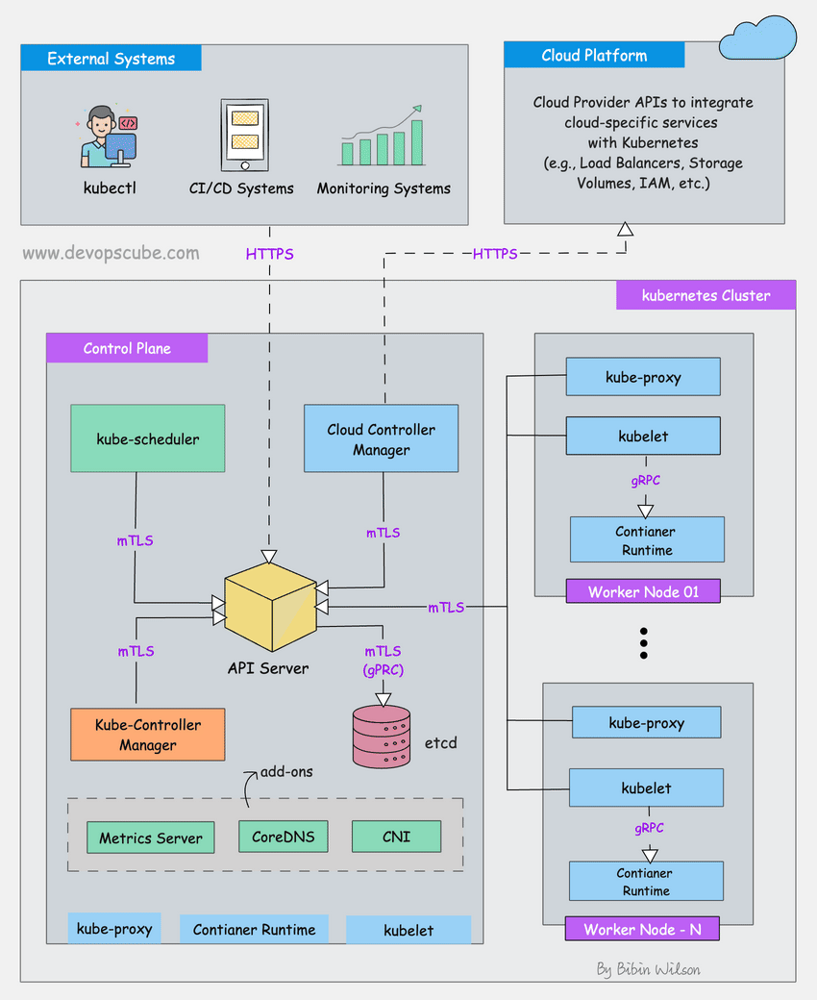

- Kubernetes is a **distributed system**. Meaning, it has multiple components spread across different servers over a network. These servers could be virtual machines or bare metal servers. We call it as kubernetes cluster.
- A Kubernetes cluster consists of control plane nodes and worker nodes.


## Control Plane
- Control plane is responsible for container orchestration and maintaining the desired state of the cluster. It has the following components
  - kube-apiserver
  - etcd
  - kube-scheduler
  - kube-controller-manager
  - cloud-controller-manager
- A cluster can have one or more control plane nodes.

## Worker Node
- The Worker nodes are responsible for running containerized applications. The worker node has the following components
  - kubelet
  - kube-proxy
  - container runtime

## Core Components of Control Plane

### `kube-apiserver`
- The `kube api-server` is the central hub of the kubernetes cluster that exposes the kubernetes API. It is highly scalable and can handle large number of concurrent requests.
 - End users, and other cluster components, talk to the cluster via the API server. Very rarely monitoring systems and third-party services may talk to API server to interact with the cluster.
 - So when you use kubectl to manage the cluster, at the backend you are actually communicating with the API server through `HTTP REST APIs` over TLS.
 - Also, the communication between the API server and other components in the cluster happens over TLS to prevent unauthorized access to the cluster. <br><br> 
  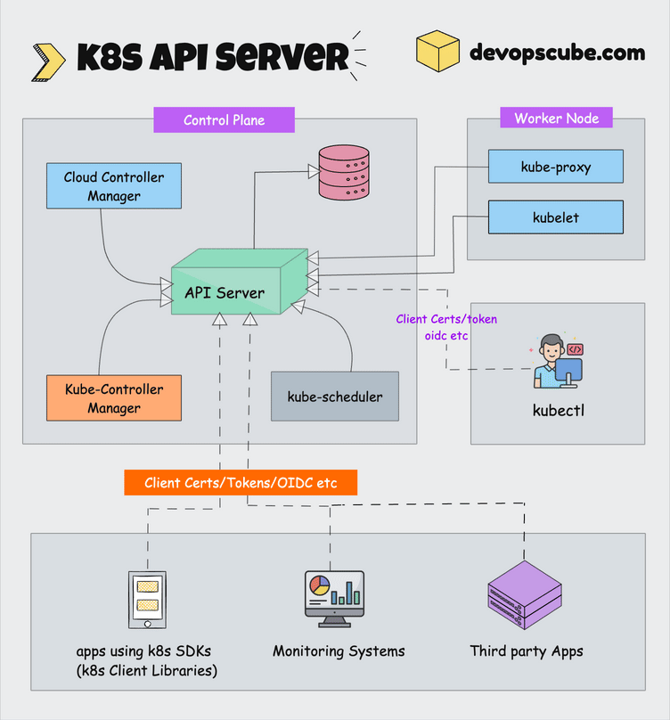

- Kubernetes `api-server` is responsible for the following:
  - `API Management`: Exposes the cluster API endpoint and handles all API requests. The API is version and its supports multiple API versions simultaneously.
  - `Authentication`: (Using client certificates, bearer tokens, and HTTP Basic Authentication) and Authorization (ABAC and RBAC evaluation)
  - Processing API requests and validating data for the API objects like pods, services, etc, (Validation and Mutation Admission controllers)
  - api-server coordinates all the processes between the control plane and worker node components.
  - API server also contains aggregation layer which allows you to extend kubernetes API to create custom APIs resources and controllers.
  - The only component that the **kube api-server initiates a connection to is the `etcd` component**. All the other components connect to the API server.
  - The api-server also supports **watching resources for changes**. For example, client can establish a watch on specific resources and receive real-time notifications when those resources are created, modified, or deleted.
  - Each component (kubelet, scheduler, controllers) **independently watches the api-server** to figure out what needs to do.
  - The api-server has a built in **api-server proxy**. It is a part of api-server process. It is primarily used to enable access to the ClusterIP services from outside the cluster.

### `etcd`

- Kubernetes is a distributed system and it needs an efficient distributed database like etcd that supports its distributed nature. It acts a both a backend service discovery and a database. You can call it the brain of the Kubernetes cluster.
- `etcd` is an open-source strongly consistent, distributed key-value pair. So what does it mean?
  - `Strongly Consistent`: If an update is made to a node, strongly consistency will ensure it gets updated to all the other nodes in the cluster immediately. Also if you look at CAP theorem, achieving 100% availability with strong consistency and Partition Tolerance is impossible.
  - `Distributed`: etcd is designed to run on multiple nodes as a cluster without sacrificing consistency.
  - `Key-Value store`: A non-relational database that stores data as keys and values. It also exposes a key-value API. The datastore is built on top of **BboltDB** which is a form of BoltDB.
- etcd uses raft consensus algorithm for strong consistency and availability. It works in a leader-member fashion for high availability and to withstand node failures.
- How does etcd works with kubernetes?
  - To put it simple, when you use kubectl to get kubernetes object details, you are getting it from etcd. Also, when you display an object like a pod, an entry gets created in etcd.

- In a nutshell, 
  - etcd stores all configurations, states, and metadata of kubernetes objects (pods, secrets, daemonsets, deployments, configmaps, statefulsets, etc).
  - `etcd` allows a client to subscribe to events using `watch()` API. Kubernetes api-server used the etcd's watch functionality to track changes in the state of an object.
  - etcd exposes key-value API using gRPC. Also, the gRPC gateway is RESTful proxy that translates all the HTTP API calls into gRPC messages. This makes it an ideal database for kubernetes.
  - etcd stores all the objects under the `/registry` directory key in key-value format. For example, information on the pods named nginx in the default namespace can be found under `/registry/pods/default/nginx`

  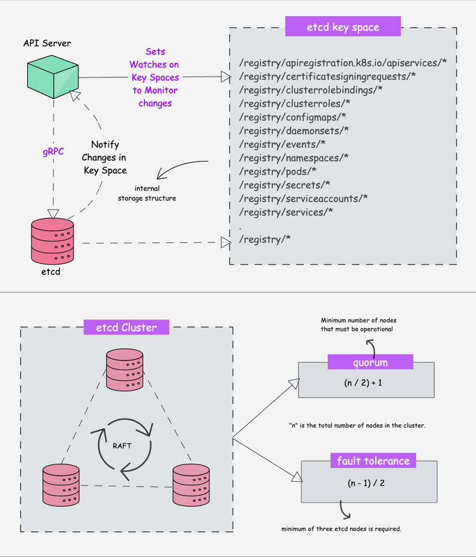

- Also, `etcd` is the only Statefulset component in the control plane.
- The number of nodes in an etcd cluster directly affects its fault tolerance. Here how it breaks down:
  - 3 nodes can tolerate 1 node failure (quorum = 2)
  - 5 nodes can tolerate 2 node failures (quorum = 3)
  - 7 nodes can tolerate 3 node failures (quorum = 4) 
- The general formula for the number of node failures a cluster can tolerate is `fault tolerance: (n-1) / 2`

### Kube-Scheduler

- The kube-scheduler is responsible for **scheduling kubernetes pods on worker nodes**.
- When you deploy a pod, you specify the pod requirements such as CPU, memory, affinity, taints or toleration's, priority, persistent volumes (PV), etc. The scheduler's primary task is to identify the create request and choose the best node for a pod that satisfies the requirements.

  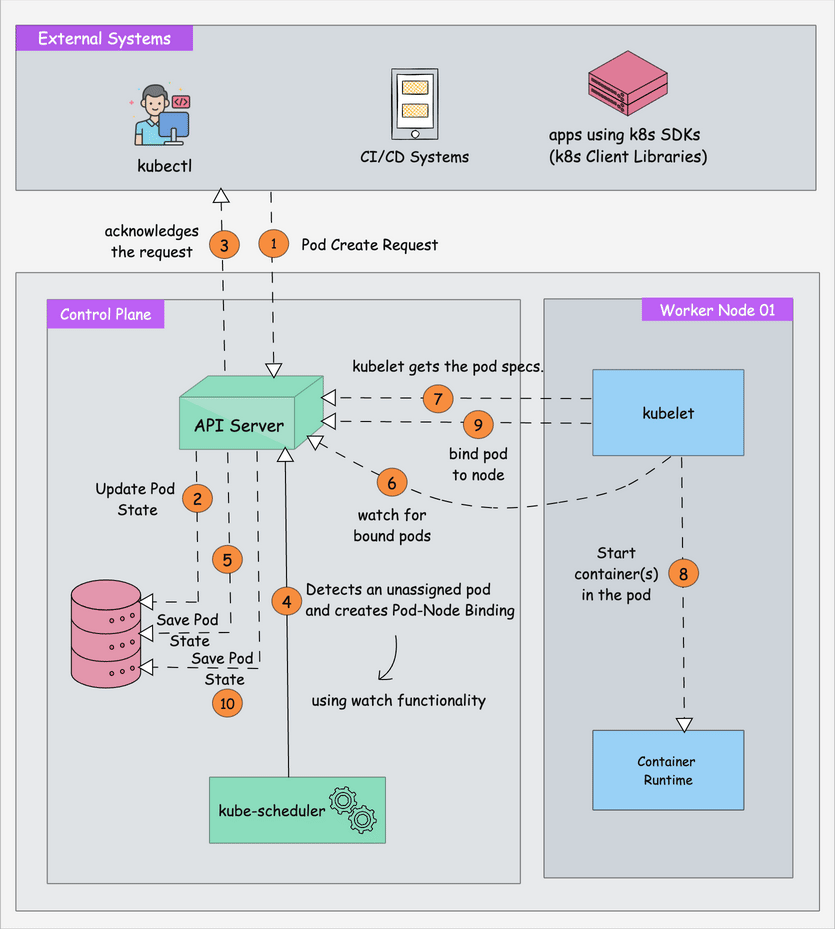

- In a kubernetes cluster, there will be more than one worker node. So how does the scheduler select the node out of all worker nodes?
  - To choose the best node, The Kube-Scheduler uses filtering and scoring operations.
  - In filtering, the scheduler finds the best-suited nodes where the pod can be scheduled. 
    - For example, If there are five worker nodes with resource availability to run the pod, it selects all five nodes. If there are no nodes, then the pod is unscheduled and moved to the scheduling queue.
    - If it's a large cluster, let's say 100 worker nodes, and the scheduler doesn't iterate over all the nodes. 
    - There is a scheduler configuration parameter call `percentageOfNodesToScore`. The default value is typically `50%`. So it tries to iterate over 50% of nodes in a round-robin fashion. If the worker nodes are spread across multiple zones, then the scheduler iterates over nodes in different zones. For very large clusters the default `percentageOfNodesToScore` is 5%.
  - In the scoring phase, the scheduler ranks the nodes by assigning a score to the filtered worker nodes. The scheduler makes the scoring by calling multiple scheduling plugins. Finally, the worker nodes with the highest rank will be selected for scheduling the pod. If all the nodes have same rank, a node will be selected at random.
  - Once the node is selected the scheduler creates a binding event in the API server. Meaning an event to bind a pod and node.

  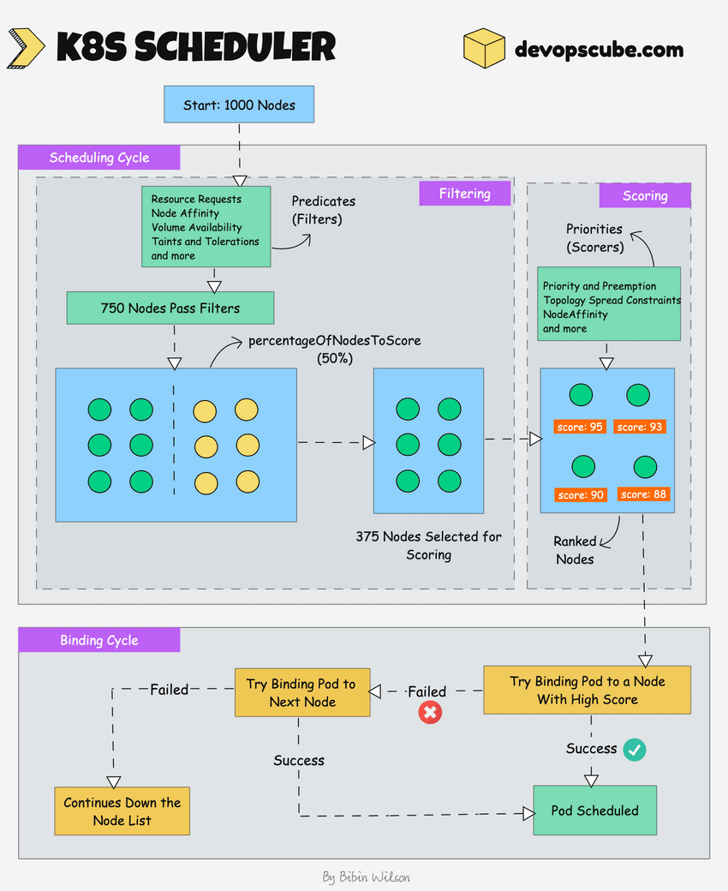

- Things to know about kube-scheduler
  - It is a controller that listens to pod creation events in the API server.
  - The scheduler has two phases. `Scheduling Cycle` and the `Binding Cycle`. Together it is called the scheduling content. The scheduling cycle selects a worker node and the binding cycle applies that change to the cluster.
  - The scheduler always places the high-priority pods ahead of low-priority pods for scheduling. Also, in some cases, after the pod starts running in the selected node, the pod might get evicted or moved to other nodes.
  - You can create custom schedulers and run multiple schedulers in a cluster along with the native scheduler. When you deploy a pod you can specify the custom scheduler in the pod manifest. So the scheduling decisions will be taken based on the custom scheduler logic.
  - The scheduler has a pluggable scheduling framework. Meaning, that you can add your custom plugin to the scheduling workflow.


### Kube Controller Manager
- What is a controller?
  - Controllers are programs that run infinite control loops. Meaning it runs continuously and watches the actual and desired state of objects. If there is a difference in the actual and desired state, it ensures that the kubernetes resources/object is in the desired state.
- As per the official docs 
  ```
  In kubernetes, controllers are control loops that watch the state of your cluster, then makes or requests changes where needed. Each controller ties to move the current cluster state closer to the desired state.
  ```

- Lets say you want to create a deployment, you specify the desired state in the manifest YAML file (declarative approach).
  - For example 2 replicas, one volume mount, configmap etc. The in-built deployment controller ensures that the deployment is in the desired state all the time. If a user updates the deployment with 5 replicas, the deployment controller recognizes it and ensures the desired state in 5 replicas.

- Kube Controller Manager is a component that manages all the kubernetes controllers. Kubernetes resources/objects like pods, namespaces, jobs, replicaset are managed by respective controllers. Also, the kube-scheduler is also a controller managed by the kube controller manager.

  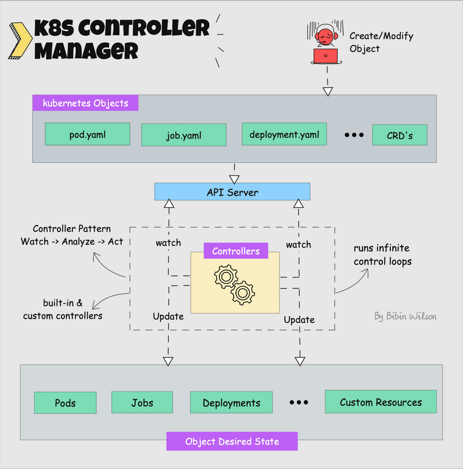

- The following are the list of built-in kubernetes controllers
  - Deployment Controller
  - Replicaset Controller
  - DaemonSet Controller
  - Job Controller
  - CronJob Controller
  - endpoints Controller
  - namespace controller
  - service accounts controller
  - Node Controller

### Cloud Controller Manager (CCM)
- When kubernetes is deployed in cloud environments, the cloud controller manager acts a bridge between cloud platform APIs and the kubernetes cluster.
- This way the core kubernetes core components can work independently and allow the cloud providers to integrate with kubernetes using plugins.
- Cloud Controller Integration allows the kubernetes cluster to provision cloud resources like instances (for nodes), Load Balancers (for services), and Storage Volumes (for persistent volumes)

  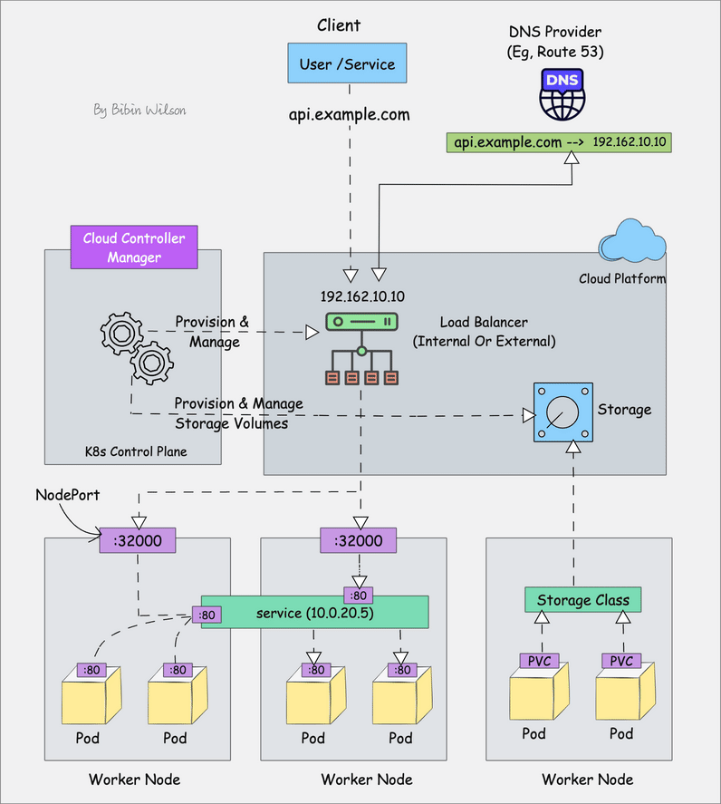

- Cloud Controller Manager contains a set of **cloud platform-specific controllers** that ensure the desired state of the cloud-specific components (nodes, LoadBalancers, storage, etc). The following are the three main controllers that are part of the cloud controller manager.
  - *Node Controller*: This controller updates node-related information by talking to the cloud provider API. For example, node labeling & annotation, getting hostname, CPU & memory availability, nodes health, etc.
  - *Route Controller*: It is responsible for configuring networking routes on a cloud platform. So that pods in different nodes can talk to each other.
  - *Service Controller*: It takes care of deploying load balancers for kubernetes, assigning IP addresses, etc.


## Core Components of Kubernetes Worker Node

### Kubelet
- kubelet is an agent component that runs on every node in the cluster. It doesn't run as a container instead runs as a daemon, managed by systemd.
- It is responsible for registering worker nodes with the api-server and working with the podSpec primarily from the API server.
- podSpec defines the containers that should run inside tge pod, their resources, and other settings such as environment variables, volumes, and labels.
- Kubelet is responsible for the following
  - Creating, modifying and deleting containers for the pod.
  - Responsible for handling liveliness, readiness, and startup probes.
  - Responsible for mounting volumes by reading pod configuration and crating respective directories on the host for the volume mount.
  - Collecting and reporting Node and pod status via calls to the API server with implementations like `cAdvisor` and `CRI`.
- Kubelet can accept podSpec from a file, HTTP endpoint, and HTTP server. A good example of `podSpec from a file` is kubernetes static pods.
- You can create pods by providing a pod YAML location to the kubelet component. However, the static pods created by kubelet are controlled by kubelet, not the api-server.
- The real-world use case of static pods is `while bootstrapping the control plane, kubelet stats the api-server, scheduler and control manager as static pods from podSpecs located at '/etc/kubernetes/manifests'`

- Key things about kubelet
  - kubelet uses the CRI gRPC interface to talk to the container runtime.
  - It also exposes a HTTP endpoint to stream logs and provide exec sessions for clients.
  - Uses the CSI (Container Storage Interface) gRPC to configure block volumes.
  - It uses the CNI plugin configured in the cluster to allocate the pod IP addresses and set up any necessary network routes and firewall rules for the pod.
  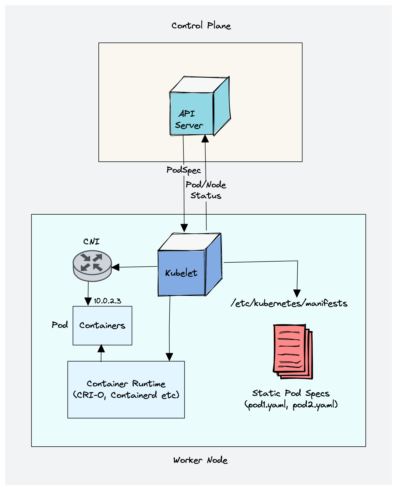

### Kube Proxy
- Kube Proxy is a daemon that runs on every node as a daemonset. It is a proxy component that implements the kubernetes services concept for pods. It primarily proxies UDP, TCP and SCTP and it does not understand HTTP.
- When you expose pods as a Service (ClusterIP), kube-proxy creates network rules to send traffic to the backend pods (endpoints) grouped under Service object. Meaning, all the load balancing and service discovery are handled by the kube proxy.
- How does kube-proxy works?
  - Kube proxy talks to the API server to get the details about the Service (ClusterIP) and respective pod IPs and ports (endpoints). It also monitors for changes in service and endpoints.
  - kube-proxy then uses any one of the following modes to create/update rules for routing traffic to pods behind a Service.
    - `IPTables`: It is the default mode. In IPTables mode, the traffic is handled by IPTable rules. This means that for each service, IPTable rules are created. These rules capture the traffic coming to the ClusterIP and then forward it ti the backend pods. Also, in this mode, kube-proxy chooses the backend pod random for load balancing. Once the connection is established, the requests go to the same pod until the connection is terminated.
    - `NFTables`: This mode is currently in beta. It primarily addresses the performance and scalability limitations in `iptables`, typically in large clusters with thousands of services.
    - `IPVS`: For clusters with services exceeding 1000, IPVS offers performance improvement. It supports the following load-balancing algorithm for the backend.
      - `rr`: round-robin, it is the default mode.
      - `lc`: least connection (smallest number of open connections)
      - `dh`: destination hashing.
      - `sh`: source hashing
      - `sed`: shortest expected delay
      - `nq`: never queue
    - `Userspace` (legacy & not recommended)
    - `Kernelspace`: This mode is only for windows systems.
  
  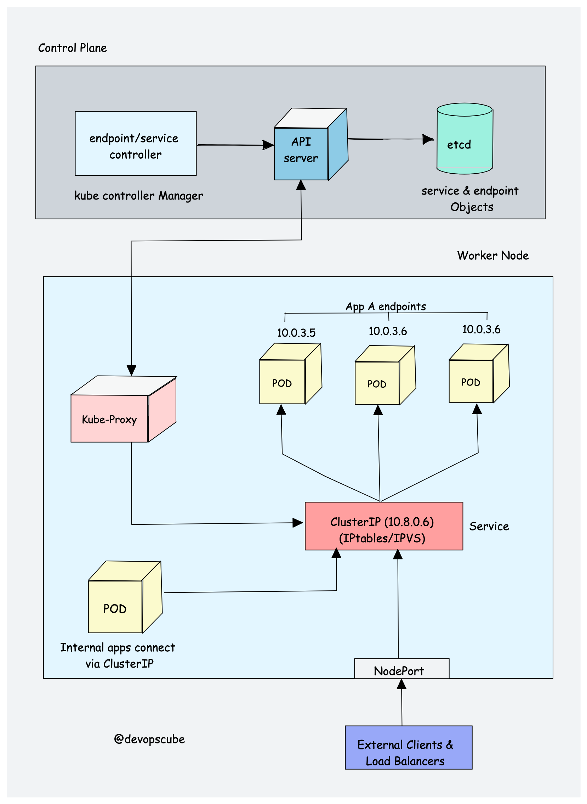

### Container Runtime
- Container runtime runs on all the nodes in the kubernetes cluster. It is responsible for pulling images from container registries, running containers, allocating and isolating resources for containers and managing the entire lifecycle of a container on a host.
- To understand better, lrt's take a look at two key concepts
  - `Container Runtime Interface (CRI)`: It is a set of APIs that allows kubernetes to interact with different container runtimes. It allows different container runtimes to be used interchangeably with kubernetes. The CRI defines the API for creating, starting, stopping and deleting containers, as well as for managing images and container networks.
  - `Open Container Initiative (OCI)`: It is a set of standards for container formats and runtimes
- Kubernetes supports multiple container runtimes (CRI-O, Docker Engine, containerd etc) that are compliant with CRI. This means, all these container runtimes implement CRI interface and expose gRPC CRI APIs.
- The below is the high-level overview of how container runtime works with kubernetes.
  
  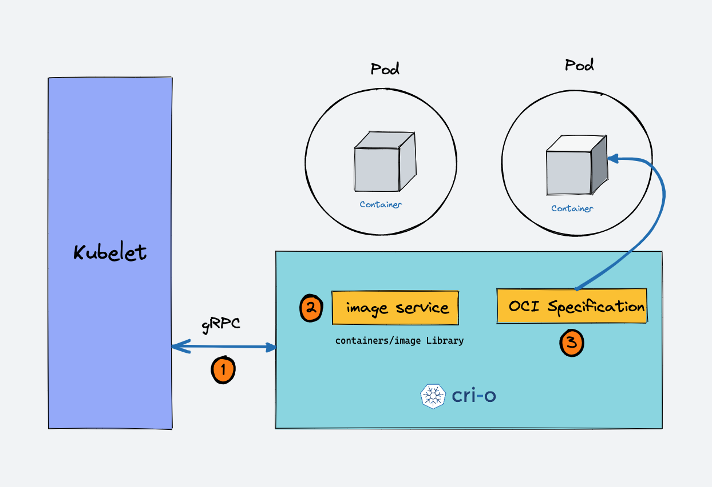
  - When there is a new request for a pod from the API server, the kubelet talks to CRI-O daemon to launch the required containers via kubernetes CRI.
  - CRI-O checks and pulls the required container image from the configured container registry using `containers/image` library.
  - CRI-O then generates OCI runtime specification (JSON) for a container.
  - CRI-O then launches an OCI-compatible runtime (runc) to start the container as per the runtime specification.


## Kubernetes Cluster Addon Components
- Apart form the core components, the kubernetes cluster needs addon components to be fully operational. Choosing an addon depends on the project requirements and use cases.
- Following are some of the popular addon components that you might need on a cluster.
  - `CNI Plugin`
  - `CoreDNS`: CoreDNS acts as a DNS server within the kubernetes cluster. By enabling this addon, you can enable DNS-based services discovery.
  - `Metrics Server`: This addon helps you collect performance data and resource usage of Nodes and pods in the cluster.
  - `Web UI`: This addon enables the kubernetes dashboard to manage the object via web UI.

### CNI in Kubernetes
- CNI is a specification and set of libraries for configuring network interfaces in Linux Containers. It's managed by the **Cloud Native Computing Foundation (CNCF)**
- In kubernetes CNI is used to enable pod networking - assigning IP addresses, setting up routing, and network policies between pods.

### CNI Plugin
- Its a plugin-based architecture with vendor-neutral specifications and libraries for creating network interfaces for containers.
- It is not specific to kubernetes. With CNI container networking can be standardized across container orchestration tools like kubernetes, Mesos, CloudFoundry, Podman, Docker , etc.
- When it comes to container networking, companies might have different requirements such as network isolation, security, encryption, etc. As container technology advanced, many network providers created CNI-based solutions for containers with a wide range of networking capabilities. You can call it CNI-Plugins.
- How CNI-Plugin works with kubernetes
  - The Kube Controller Manager is responsible for assigning pod CIDR to each node. Each pod gets a unique IP address for the pod CIDR.
  - Kubelet interacts with container runtime to launch the scheduled pod. The CRI plugin which is the part of container runtime interacts with the CNI plugin to configure the POD Network.
  - CNI plugin enables networking between pods spread across the same or different nodes using an overlay network.

  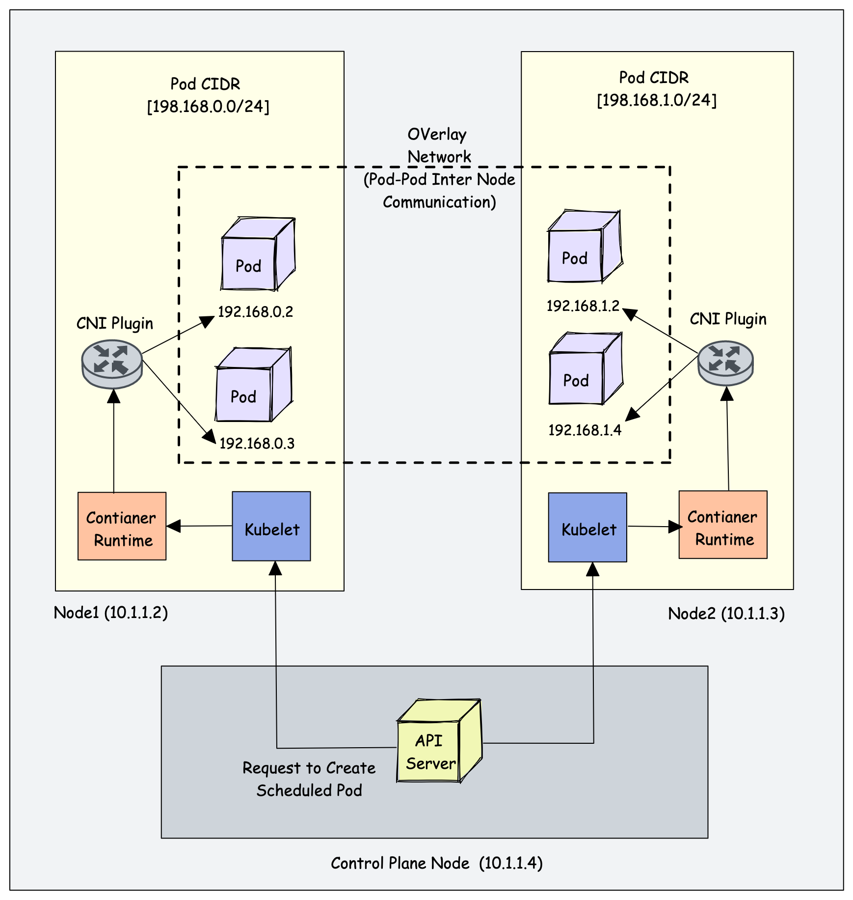