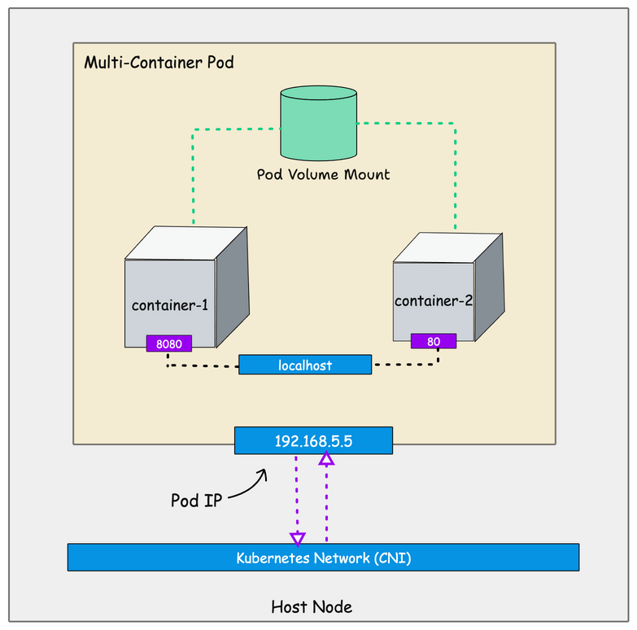

# Kubernetes Pod

- A container is a self-contained environment where we package applications and their dependencies. Typically, a container runs a single process (Although there are ways to run multiple processes).
- Each container gets an IP address and can attach volumes and control CPU and memory resources, among other things. All these happen via the concepts of namespaces and control groups.
- Kubernetes is a container orchestration system for deploying, scaling and managing containerized applications, and it has its own way of running containers. We call it a pod. A pod is the smallest deployable unit in kubernetes that represents a single instance of an application.
- A container is a single unit. However a pod can container more than one container. you can think of pods as a box that can hold one or more containers together.
- Pod provides a higher level of abstraction that allows you to manage multiple containers as a single unit. Here instead of each container getting IP address, **the pod get as single unique IP address and containers running inside the pod use localhost to connect to each other on different ports**.



- The containers inside the kubernetes pod shares the following
  - **Network namespace** - All containers inside a pod communicate via localhost.
  - **IPC namespace**: All containers use a shared inter process communication namespace
  - **UTS namespace**: All containers share the same hostname.
- What is not shared between containers inside a pod?
  - By default, the PID namespace is not shared however kubernetes provide options to enable process sharing between containers inside the pod using `sharedProcessNamespace` option
  - The **mount namespace is not shared between containers**. Each container has its own private filesystem and directories. However, the **pod mount volumes are shared between containers**.

## Creating a Pod
You can create a pod in two ways
1. Using the kubectl imperative command
2. Declarative approach: using YAML manifest. When working on projects the YAML manifest is used to deploy pods.

### Method 1: Using `kubectl` command

```bash

$ kubectl run web-server-pod \
    --image=nginx:latest
    --restart=Never \
    --port=80 \
    --labels=app=web-server,environment=production \
    --annotations description='This pod runs the web server'

$ pod/web-server-pod created
```
- Here the pod gets deployed in default namespace. You can get the status of the deployed pods using kubectl command

```bash
$ kubectl get pods

NAME             READY   STATUS    RESTARTS   AGE
web-server-pod   1/1     Running   0          42s
```
- Once the pod is deployed you will see the Pod `Running` status as shown below.

- To describe the pod created, we can use `kubectl describe`

```bash
$ kubectl describe pods/web-server-pod

Name:             web-server-pod
Namespace:        default
Priority:         0
Service Account:  default
Node:             minikube/192.168.49.2
Start Time:       Sat, 23 Aug 2025 19:14:09 +0530
Labels:           app=web-server
                  environment=production
Annotations:      description: This is a pod running web server
Status:           Running
IP:               10.244.0.3
IPs:
  IP:  10.244.0.3
Containers:
  web-server-pod:
    Container ID:   docker://0532dae64d755828c8f88bd2b533a4d78a63b435444f7a0d04bc1d6960cd6c52
    Image:          nginx:latest
    Image ID:       docker-pullable://nginx@sha256:33e0bbc7ca9ecf108140af6288c7c9d1ecc77548cbfd3952fd8466a75edefe57
    Port:           80/TCP
    Host Port:      0/TCP
    State:          Running
      Started:      Sat, 23 Aug 2025 19:14:39 +0530
    Ready:          True
    Restart Count:  0
    Environment:    <none>
    Mounts:
      /var/run/secrets/kubernetes.io/serviceaccount from kube-api-access-zmlx8 (ro)
Conditions:
  Type                        Status
  PodReadyToStartContainers   True 
  Initialized                 True 
  Ready                       True 
  ContainersReady             True 
  PodScheduled                True 
Volumes:
  kube-api-access-zmlx8:
    Type:                    Projected (a volume that contains injected data from multiple sources)
    TokenExpirationSeconds:  3607
    ConfigMapName:           kube-root-ca.crt
    ConfigMapOptional:       <nil>
    DownwardAPI:             true
QoS Class:                   BestEffort
Node-Selectors:              <none>
Tolerations:                 node.kubernetes.io/not-ready:NoExecute op=Exists for 300s
                             node.kubernetes.io/unreachable:NoExecute op=Exists for 300s
Events:
  Type    Reason     Age    From               Message
  ----    ------     ----   ----               -------
  Normal  Scheduled  3m33s  default-scheduler  Successfully assigned default/web-server-pod to minikube
  Normal  Pulling    3m33s  kubelet            Pulling image "nginx:latest"
  Normal  Pulled     3m4s   kubelet            Successfully pulled image "nginx:latest" in 28.827s (28.827s including waiting). Image size: 197916407 bytes.
  Normal  Created    3m4s   kubelet            Created container web-server-pod
  Normal  Started    3m3s   kubelet            Started container web-server-pod
```

- Finally, To delete a pod, we can use `kubectl delete`

```bash
$ kubectl delete pods/web-server-pod
pod "web-server-pod" deleted
```


### Method 2: Using declarative  YAML approach
- To deploy a pod using declarative approach, we will create a yaml manifest file and use kubectl to deploy the pod

```bash
$ cat pod/manifests/nginx.yaml 

apiVersion: v1
kind: Pod
metadata:
    name: web-server-pod
    labels:
        app: web-server
        environment: production
    annotations:
        description: This pod runs the web server
spec:
    containers:
        - name: web-server
          image: nginx:latest
          ports:
            - containerPort: 80

$ kubectl apply -f pod/manifests/nginx.yaml 
pod/web-server-pod created

$ kubectl get pods
NAME             READY   STATUS    RESTARTS   AGE
web-server-pod   1/1     Running   0          7s

```

## Access application running inside the Pod
- Kubectl offers a port-forward command to access running pods in kubernetes cluster from local workstation.
- We have a running pod named `web-server-pod`. Let's access it via the port-forward command.

```bash
$ kubectl port-forward pod/web-server-pod 5000:80
Forwarding from 127.0.0.1:5000 -> 80
Forwarding from [::1]:5000 -> 80
Handling connection for 5000
Handling connection for 5000

$ curl -v localhost:5000
* Host localhost:5000 was resolved.
* IPv6: ::1
* IPv4: 127.0.0.1
*   Trying [::1]:5000...
* Connected to localhost (::1) port 5000
> GET / HTTP/1.1
> Host: localhost:5000
> User-Agent: curl/8.7.1
> Accept: */*
> 
* Request completely sent off
< HTTP/1.1 200 OK
< Server: nginx/1.29.1
< Date: Sun, 24 Aug 2025 03:43:33 GMT
< Content-Type: text/html
< Content-Length: 615
< Last-Modified: Wed, 13 Aug 2025 14:33:41 GMT
< Connection: keep-alive
< ETag: "689ca245-267"
< Accept-Ranges: bytes
< 
<!DOCTYPE html>
<html>
<head>
<title>Welcome to nginx!</title>
<style>
html { color-scheme: light dark; }
body { width: 35em; margin: 0 auto;
font-family: Tahoma, Verdana, Arial, sans-serif; }
</style>
</head>
<body>
<h1>Welcome to nginx!</h1>
<p>If you see this page, the nginx web server is successfully installed and
working. Further configuration is required.</p>

<p>For online documentation and support please refer to
<a href="http://nginx.org/">nginx.org</a>.<br/>
Commercial support is available at
<a href="http://nginx.com/">nginx.com</a>.</p>

<p><em>Thank you for using nginx.</em></p>
</body>
</html>
* Connection #0 to host localhost left intact
```

- Here is what happens when you run kubectl port-forward command
  - kubectl binds the specified port in your local system. in our case, it's `5000`
  - It then communicated with the kubernetes cluster API to establish a tunnel (a single HTTP connection) to the required node and then to the specified pod and container port, i.e., 80.

## Access Pod Shell
- There are many use cases where you need terminal access to the pod. One main use case is debugging and pod troubleshooting.
- We can use `kubectl exec` to access the pod shell

```bash
$ kubectl exec pods/web-server-pod -it -- /bin/bash

root@web-server-pod:/# whoami
root
root@web-server-pod:/# cat /etc/os-release 
PRETTY_NAME="Debian GNU/Linux 12 (bookworm)"
NAME="Debian GNU/Linux"
VERSION_ID="12"
VERSION="12 (bookworm)"
VERSION_CODENAME=bookworm
ID=debian
HOME_URL="https://www.debian.org/"
SUPPORT_URL="https://www.debian.org/support"
BUG_REPORT_URL="https://bugs.debian.org/"
root@web-server-pod:/# 

```

## Pod LifeCycle
- A pod is typically managed by a controller like ReplicaSet Controller, Deployment controller, etc. When you create a single pod using YAML, it is not managed by any controller. In both cases a pod goes through different lifecycle phases.
- The following are pod lifecycle phases
  - `Pending`: It means the pod creation request is successful, however, the scheduling is in progress, For example, it is int he process of downloading the container image.
  - `Running`: The pod is successfully running and operating as expected. For example, the pod is service client requests.
  - `Succeeded`: All containers inside the pod have been successfully terminated. For example, the successful completion of a CronJob object.
  - `Failed`: All pods are terminated but at least one container has terminated in failure. For example, the application running inside the pod is unable to start due to a config issue and the container exits with a non-zero exit code.
  - `Unknown`: Unknown state of the pod. For example, the cluster is unable to monitor the status of the pod.
- If we describe the pod using `kubectl describe pod/web-server-pod` we can view the phase of the pod.

## Pod Features
- We have deployed a simple Nginx pod with very minimal configurations. However, a pod had a lot of features for resource management, configuration, secrets, availability, security, etc.
- Following are the key features related to the pod.
  - `Resource Requests & Limits`: POD CPU/Memory Allocation.
  - `Labels`: key-value pairs attached to the pods to categorize resources.
  - `Selectors`: To group resources based on labels
  - `Liveness, Readiness & Startup Probes`: Container Health Checks
  - `ConfigMap`: For Config Management
  - `Secrets`: For Secret Management
  - `Volumes`: Persistent Data
  - `Init Containers`: Containers that run before the main containers.
  - `Ephemeral Containers`: Temporary containers added to the pod for debugging or troubleshooting purposes.
  - `ServiceAccount`: To restrict access to Kubernetes Objects & Resources
  - `SecurityContext`: Host permissions and privileges
  - `Affinity and Anti-Affinity Rules`: Pod placement control across nodes.
  - `Pod Preemption & Priority`: Setting priorities for pod scheduling & eviction.
  - `Pod Disruption Budget`: The minimum number of pod replicas that need to be running during a voluntary disruption.
  - `Container Life Cycle Hooks`: Executing custom scripts based on the pod's lifecycle phase changes.
  - `dnsConfig`: For custom DNS setting
  - `dnsPolicy`: defines how DNS resolution works inside the pod.

## Comprehensive Pod Yaml Configuration

  ```yaml
  ---
  apiVersion: v1
  kind: Pod
  metadata:
    name: web-server-pod
  spec:
    initContainers:
      - name: init-service
        image: busybox:latest
        command: ['sh', '-c', 'echo "Init container started!"']
    containers:
      - name: nginx-web-server
        image: nginx:latest
        ports:
          - containerPort: 80
        volumeMounts:
          - mountPath: /var/cache/nginx
            name: nginx-cache
          - mountPath: /var/run
            name: var-run
          - name: nginx-config
            mountPath: /etc/nginx
        securityContext:
          capabilities:
            drop:
              - ALL
          readOnlyRootFilesystem: true
          runAsNonRoot: true
          runAsUser: 1000
        resources:
          requests:
            cpu: 100m
            memory: 126Mi
          limits:
            cpu: 200m
            memory: 256Mi
        readinessProbe:
          httpGet:
            port: 80
            path: /index.html
          initialDelaySeconds: 5
          periodSeconds: 5
        livenessProbe:
          httpGet:
            port: 80
            path: /index.html
          initialDelaySeconds: 15
          periodSeconds: 20
          timeoutSeconds: 20
        startupProbe:
          httpGet:
            port: 80
            path: /index.html
          initialDelaySeconds: 30
          failureThreshold: 30
          periodSeconds: 10
        lifecycle:
          postStart:
            exec:
              command: ["/bin/sh","-c","echo 'Post Start'"]
          preStop:
            exec:
              command: ["/bin/sh","-c","echo 'Pre Stop'"]
    serviceAccountName: nginx-service-account
    securityContext:
      runAsUser: 1000
      runAsGroup: 3000
      fsGroup: 2000
    shareProcessNamespace: true
    volumes:
      - name: nginx-cache
        emptyDir: {}
      - name: var-run
        emptyDir: {}
      - name: nginx-config
        configMap:
          name: nginx-config
  ```

## Pod Associated Objects
- When it comes to running applications on kubernetes, we don't run an individual pod. Because kubernetes is all about `scaling and maintaining` the availability of pods.
- So if you run a single pod, it will be a `single point of failure`. Because the pods themselves cannot be directly scaled. We need controllers like ReplicaSet to ensure the desired number of pods are running at all the time.
- Kubernetes has different types of objects associated with pods for different use cases.
- The following are important pod associations 
  - `ReplicaSet`: To maintain a stable set of pods replicas running at any given time.
  - `Deployment`: To tun stateless applications like web servers, API's etc.
  - `StatefulSet`: To run stateful applications like distributed systems.
  - `Daemonsets`: To run agent on all kubernetes nodes.
  - `Jobs`: For batch processing
  - `CronJobs`: Scheduled Jobs

## Note:
- `SideCar Cntainer`: It is a secondary container, works with a main container to get information like logs or inject information like configuration to the main container.
- `Static Pods`: These are system pods (etcs, kube-apiserver, kube-controller, and kube-scheduler) which are directly managed by kubelet. We can't delete them until we move them from the path `/etc/kubernetes/manifests`.